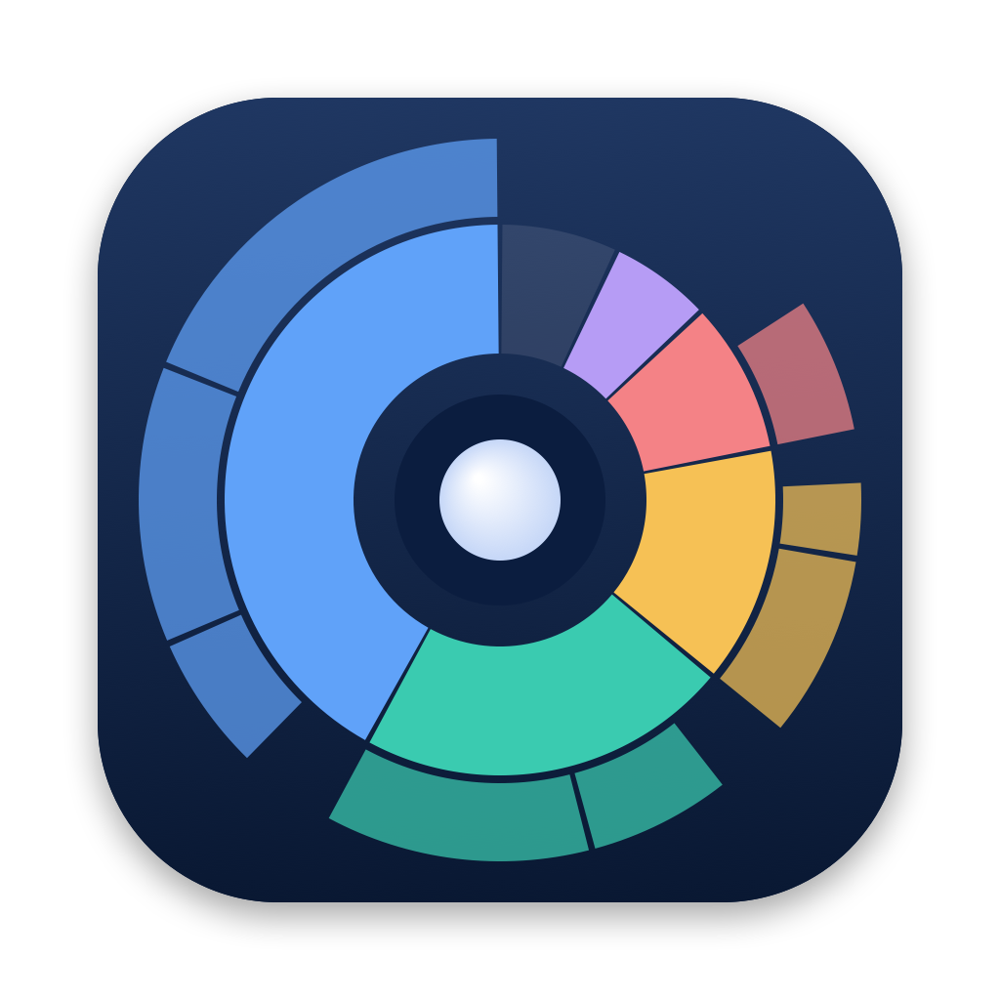

<p align="center"></p>

<h1 align="center">diskwatch</h1>

<p align="center">Find out what is eating your disk, and what changed since yesterday,<br>without a disk analyser that eats your RAM.</p>

---

diskwatch keeps a **cached index of your whole disk** (built with [duc](https://duc.zevv.nl)),
re-indexes it on a schedule at background priority, and keeps **dated snapshots** so it can
tell you *what grew*. Every report reads the index, so it answers instantly and uses a few
megabytes of memory; a full scan of a 500 GB disk peaks around 40 MB.

It runs on **macOS 12 Monterey and later** (as a small self-contained app, Apple silicon and
Intel) and on **Debian / Proxmox** servers (a script plus systemd timers, with an Ansible
role).

```text
$ diskwatch report
Free space: 11.0G
Changes since 2026-10-07T1046 → 2026-10-08T1207 (≥ 200MB):
     +4.2G  now    29.2G  /Users/me/.ollama/models
     +1.2G  now     4.1G  /Users/me/Library/Caches/com.example.app
     -1.3G  now     5.9G  /Users/me/.cache
```

## Features

|  | macOS | Linux |
|---|---|---|
| Whole-disk cached index, instant `ls` / `du` / `report` / `history` | ✓ | ✓ |
| Terminal browser with vim keys (`j/k h/l g/G`, `i` file info) | ✓ | ✓ |
| User-settable schedule, catches up after sleep | `diskwatch schedule` | systemd timers |
| Growth and low-space alerts | notifications | journal / any command (ntfy, mail…) |
| Unused apps / packages | `apps` (Spotlight + run sampling) | `pkgs` (atime + run sampling) |
| Cloud-drive placeholders (iCloud, Google Drive, OneDrive) | `cloud` | – |
| Block-level storage (LVM thin, ZFS, Proxmox guests) | – | `storage` |
| Reclaimable-space hints (journal, apt, kernels, Docker…) | – | `cleanup` |
| Correct accounting on APFS (firmlink loop, clones, reserves) | ✓ | – |
| Progress bar for running scans | `progress` | `progress` |
| Agent skill for AI coding assistants | ✓ | ✓ |

## Install

**macOS:** download `Diskwatch-<version>-macos-universal.zip` from
[Releases](https://github.com/valmayaki/diskwatch/releases), then:

```sh
unzip Diskwatch-*-macos-universal.zip -d ~/Applications
xattr -dr com.apple.quarantine ~/Applications/Diskwatch.app      # unsigned build, see INSTALL
~/Applications/Diskwatch.app/Contents/MacOS/diskwatch-launcher install
```

Then add `~/Applications/Diskwatch.app` under **System Settings → Privacy & Security →
Full Disk Access**, and run `diskwatch scan` for the first index.

**Debian / Proxmox:**

```sh
sudo apt install duc
sudo install -m 755 linux/diskwatch /usr/local/bin/diskwatch
sudo diskwatch install            # systemd timers: nightly scan, package sampling
sudo diskwatch scan               # first index
```

or for many hosts, the Ansible role in [`linux/ansible`](linux/ansible).

Full details, system dependencies and building from source: **[docs/INSTALL.md](docs/INSTALL.md)**.

## Use

```sh
diskwatch report                 # what grew or shrank since the previous scan
diskwatch ls ~/Library 15        # largest items in a folder (from the index)
diskwatch du ~/.cache /opt       # size of specific paths
diskwatch history ~/Library      # one folder across every snapshot
diskwatch ui                     # browse interactively (vim keys, i = info, ? = help)
diskwatch schedule scan daily 03:00     # macOS: when scans run
diskwatch apps --days 90         # macOS: large apps unused for 90+ days
sudo diskwatch storage           # Linux: thin pools, ZFS, Proxmox guest disks
sudo diskwatch cleanup           # Linux: what can be reclaimed, and how
```

Every command, option, environment variable and data file: **[docs/API.md](docs/API.md)**.

## Documentation

| | |
|---|---|
| [docs/INSTALL.md](docs/INSTALL.md) | Requirements, system dependencies, install, upgrade, uninstall, troubleshooting |
| [docs/API.md](docs/API.md) | Command reference, configuration, environment, data file formats, launcher interface |
| [docs/ARCHITECTURE.md](docs/ARCHITECTURE.md) | How it works: indexing, scheduling, privacy permissions, APFS and Proxmox pitfalls |
| [docs/SKILLS.md](docs/SKILLS.md) | The bundled agent skill: let AI coding assistants analyse disk usage safely |
| [CONTRIBUTING.md](CONTRIBUTING.md) | Development setup, conventions, tests, building, releasing |
| [CHANGELOG.md](CHANGELOG.md) | Release history |

## Licence

diskwatch is MIT-licensed (see [LICENSE](LICENSE)). Release binaries include
[duc](https://github.com/zevv/duc) (LGPL-3.0) with a small patch, and
[Tokyo Cabinet](https://dbmx.net/tokyocabinet/) (LGPL-2.1); see
[THIRD_PARTY_NOTICES.md](THIRD_PARTY_NOTICES.md).
